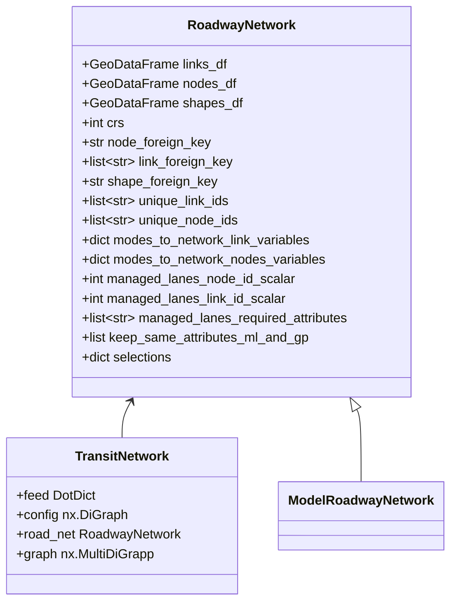
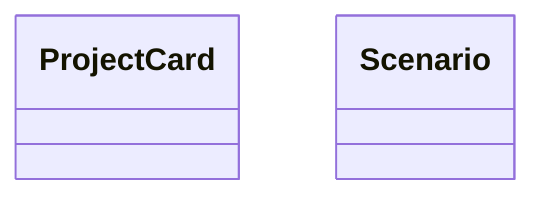
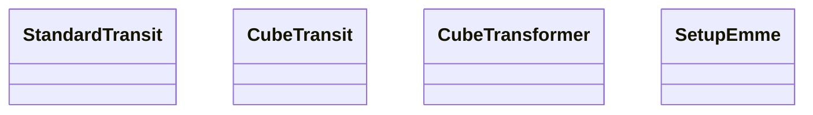

# Architecture Thoughts
Initial thoughts on architecture of network_wrangler, lasso, ranch (and travel-model-two-networks)

## Code References
Note that the below diagrams and text link to MTC's working versions of these modules, which are:
* [BayAreaMetro/network_wrangler, generic_agency branch](https://github.com/BayAreaMetro/network_wrangler/tree/generic_agency)
* [BayAreaMetro/Lasso, mtc_parameters branch](https://github.com/BayAreaMetro/Lasso/tree/mtc_parameters)
* [wsp-sag/Ranch](https://github.com/wsp-sag/Ranch) is not being used by our codebase at this time; instead we have pipeline scripts in
* [BayAreaMetro/travel-model-two-networks, develop branch](https://github.com/BayAreaMetro/travel-model-two-networks/tree/develop)

## Overall Comments
I think these libraries are a great start but there are some issues that I see as being critical to fix:
* **Documentation** -- Whenever our staff looks at the code, we end up with *so many* questions.  We'd be happy to add answers to the documentation as we figure it out BUT they won't be useful to the greater project without
* **Branch housekeeping** -- There are many active branches: 
  * [wsp-sag/network_wranger](https://github.com/wsp-sag/network_wrangler/branches): master, develop, develop_with_ranch, generric_agency
  * [wsp-sag/Lasso](https://github.com/wsp-sag/Lasso/branches): master, develop, develop_with_ranch, generic_agency
  * Not to mention forks which add even more versions of these branches
  * The work to make a plan for this and execute it is likely related to the future Governance/Funding conversation
* **Tests** -- I think a lot of the potential for making sure these libraries work as expected with continuous development is through testing infrastructure, but this is currently [not maintained](https://travis-ci.org/github/wsp-sag/network_wrangler/branches).  See my attempt to fix tests on [wsp-sag/network_wrangler, develop branch](https://github.com/wsp-sag/network_wrangler/pull/281)

## Existing Classes

* [RoadwayNetwork](https://bayareametro.github.io/network_wrangler/_generated/network_wrangler.RoadwayNetwork/) is described simply as a "Representation of a Roadway Network".  What does this mean?  What are the required fields?  
  * It looks like there are some schemas defined in [network_wrangler/schemas](https://github.com/BayAreaMetro/network_wrangler/tree/generic_agency/network_wrangler/schemas) which I think are interesting and potentially useful, but I am not sure if they're being used?  I think they have value, especially in validation, but would also like to see the documentation of the class reflect them to make them easier to understand and use.

### Basic Network Classes

### Project Card and Scenario

### Lasso Classes

## Other references
* [Mermaid documentation on Class Diagrams](https://mermaid-js.github.io/mermaid/#/classDiagram)
* [Understanding JSON Schema](https://json-schema.org/understanding-json-schema/index.html)

