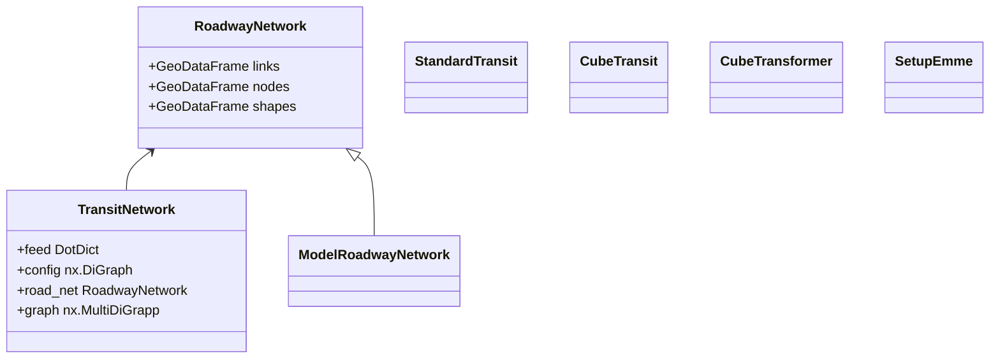

[Merrmaid documentation on Class Diagrams](https://mermaid-js.github.io/mermaid/#/classDiagram)

```mermaid
classDiagram
RoadwayNetwork <-- TransitNetwork
RoadwayNetwork <|-- ModelRoadwayNetwork

%% network_wrangler classes

  class RoadwayNetwork {
    +GeoDataFrame links
    +GeoDataFrame nodes
    +GeoDataFrame shapes
  }
  link RoadwayNetwork "https://bayareametro.github.io/network_wrangler/_generated/network_wrangler.RoadwayNetwork/" "network_wrangler.RoadwayNetwork"
  
  class TransitNetwork {
    +feed DotDict
    +config nx.DiGraph
    +road_net RoadwayNetwork
    +graph nx.MultiDiGrapp
  }
  link TransitNetwork "https://bayareametro.github.io/network_wrangler/_generated/network_wrangler.TransitNetwork/" "network_wrangler.TransitNetwork"
  
%% lasso classes

  class ModelRoadwayNetwork {
  }
  link ModelRoadwayNetwork "https://bayareametro.github.io/Lasso/_generated/lasso.ModelRoadwayNetwork/#lasso.ModelRoadwayNetwork" "lasso.ModelRoadwayNetwork"

  class StandardTransit {
  }
  link StandardTransit "https://bayareametro.github.io/Lasso/_generated/lasso.StandardTransit/#lasso.StandardTransit" "lasso.StandardTransit"
  
  class CubeTransit {
  }
  link CubeTransit "https://bayareametro.github.io/Lasso/_generated/lasso.CubeTransit/#lasso.CubeTransit" "lasso.CubeTransit"

  class CubeTransformer {
  }
  link CubeTransformer "https://bayareametro.github.io/Lasso/_generated/lasso.CubeTransformer/#lasso.CubeTransformer" "lasso.CubeTransformer"

  class SetupEmme {
  }
  link SetupEmme "https://bayareametro.github.io/Lasso/_generated/lasso.SetupEmme/#lasso.SetupEmme" "lasso.SetupEmme"
```
