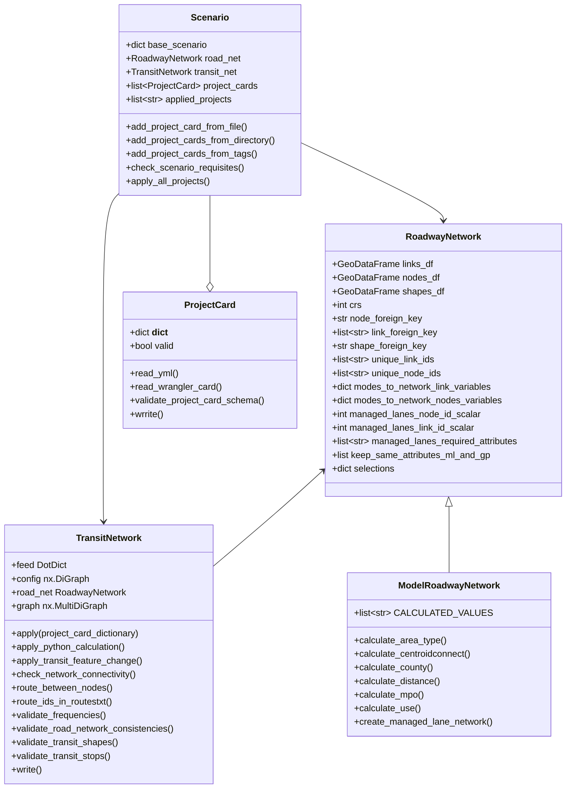
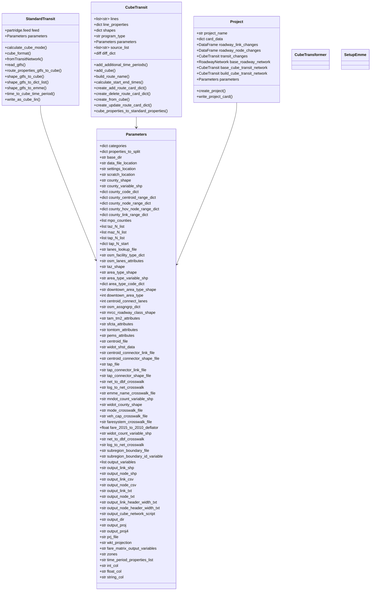
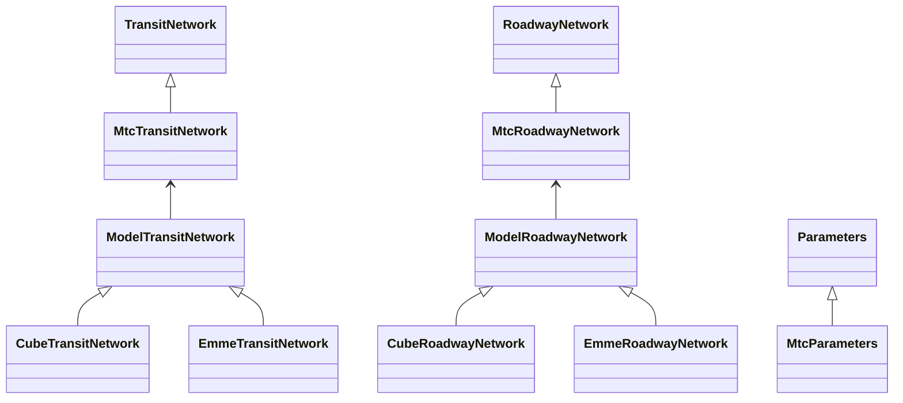

# Architecture Thoughts
Initial thoughts on architecture of network_wrangler, lasso, ranch (and travel-model-two-networks)

## Users
* **[Metropolitan Cuncil (MetCouncil)](https://metrocouncil.org)**
  * [wsp-sag/network_wrangler, develop_with_ranch branch](https://github.com/wsp-sag/network_wrangler/tree/develop_with_ranch)
  * [wsp-sag/Lasso, develop_with_ranch branch](https://github.com/wsp-sag/Lasso/tree/develop_with_ranch)
  * [wsp-sag/ranch, ?? branch](https://github.com/wsp-sag/Ranch)
  * [Metropolitan-Council/project_card_registry, Test1 branch](https://github.com/Metropolitan-Council/project_card_registry/tree/Test1)
* **[Metropolitan Transportation Commission (MTC)](https://mtc.ca.gov)** - Note that the below diagrams and text link to MTC's working versions of these modules, which are:
  * [BayAreaMetro/network_wrangler, generic_agency branch](https://github.com/BayAreaMetro/network_wrangler/tree/generic_agency)
  * [BayAreaMetro/Lasso, mtc_parameters branch](https://github.com/BayAreaMetro/Lasso/tree/mtc_parameters)
  * [wsp-sag/Ranch](https://github.com/wsp-sag/Ranch) is not being used by our codebase at this time; instead we have pipeline scripts in
  * [BayAreaMetro/travel-model-two-networks, develop branch](https://github.com/BayAreaMetro/travel-model-two-networks/tree/develop)
  * [BayAreaMetro/project_card_registry, main branch](https://github.com/BayAreaMetro/project_card_registry) not in use yet
* **Alameda/Contra Costa (BiCounty)**
  * What code was used for this?  George Naylor sent us a snapshot of the code base
* **[Link21 Rail Study](https://link21program.org/en)**
  * What code was used for this?
* **Southeast Florida??**
  * [wsp-sag/Lasso, seflorida branch](https://github.com/wsp-sag/Lasso/tree/seflorida) - Is this being used?

## Overall Comments
I think these libraries are a great start but there are some issues that I see as being critical to fix:
* **Documentation** -- Whenever our staff looks at the code, we end up with *so many* questions. This has been having a large impact on our ability to use the code base. We'd be happy to add answers to the documentation as we figure it out BUT they won't be useful to the greater project without
* **Branch housekeeping** -- There are many active branches: 
  * [wsp-sag/network_wranger](https://github.com/wsp-sag/network_wrangler/branches): master, develop, develop_with_ranch, generic_agency
  * [wsp-sag/Lasso](https://github.com/wsp-sag/Lasso/branches): master, develop, develop_with_ranch, generic_agency
  * [wsp-sag/Ranch](https://github.com/wsp-sag/Ranch/branches): main, develop, ft_python_only
  * Not to mention forks which add even more versions of these branches
  * The work to make a plan for this and execute it is likely related to the future Governance/Funding conversation
* **Tests** -- I think a lot of the potential for making sure these libraries work as expected with continuous development is through testing infrastructure, but this is currently [not maintained](https://travis-ci.org/github/wsp-sag/network_wrangler/branches).  See my attempt to fix tests on [wsp-sag/network_wrangler, develop branch](https://github.com/wsp-sag/network_wrangler/pull/281)
* **Refactoring** -- I think the code organization in the classes below need clarification at minimum, but likely some refactoring.

## MTC Requirements
MTC needs to be able to:
* Fully **understand (and help our partners understand) the pipeline *and* post-pipeline process** in order to answer questions from partners, including:
  * what files/inputs were used, including vintage/version of data downloaded/extracted during the process
  * what are the sources of the attributes in the resulting network
  * transit fare structure/files; this process is particularly inscrutable
  * a detailed log with information for the network build, including what inputs were used (e.g. what SHST version was used, what OSM vintage was included, what other networks were conflated, what vintage of GTFS files were included)  
* **Easily run the pipeline process** and subsequent steps in order to include new sources (e.g. networks from other county partners), to make adjustments of variable definitions
* **Validate that the resulting Standard Network(s) satisfy *evolving* requirements** (e.g. attributes be required, specific values, relate to other values in a specific way, etc.)  It seems like the schema should be used for this.
* **Revise the definition of the MTC Standard Network** in order to respond to feedback from partners, usability isssues, etc.  For example:
  * [num_lanes comprises of GP,HOV,ML,etc](https://github.com/BayAreaMetro/travel-model-two-networks/issues/62)
  * [Roadway links missing names (and freeway links missing route direction](https://github.com/BayAreaMetro/travel-model-two-networks/issues/58)
  * [Freeway names are not useful, missing route num](https://github.com/BayAreaMetro/travel-model-two-networks/issues/55)
  * [Link shapes do not represent direction in point order of polyline](https://github.com/BayAreaMetro/travel-model-two-networks/issues/56) 
* **Build a series of networks from a base network and the application of sets of project cards** in a way that is
  * transparent to planners (e.g. they can see the list of projects applied to each network)
  * easy to debug (e.g. [roadway links and transit lines are tagged with the project cards that modified them](https://github.com/wsp-sag/network_wrangler/issues/282)
  * validated (e.g. modelers can be sure that every network satisfies the defined requirements)

## Existing Classes

* [**network_wrangler.RoadwayNetwork**](https://bayareametro.github.io/network_wrangler/_generated/network_wrangler.RoadwayNetwork/) is described simply as a "Representation of a Roadway Network".  What does this mean?  What are the required fields?  
  * It looks like there are some schemas defined in [network_wrangler/schemas](https://github.com/BayAreaMetro/network_wrangler/tree/generic_agency/network_wrangler/schemas) which I think are interesting and potentially useful, but I am not sure if they're being used?  I think they have value, especially in validation, but would also like to see the documentation of the class reflect them to make them easier to understand and use.
  * We think it would make sense to have agency-specific **RoadwayNetwork** subclasses with additional variables (although maybe some of these would be useful to move to the base class based on discussion); for example: county, routenum (e.g. the shield number for freeways), routedir (the signed route direction for freeways), [cntype](https://github.com/BayAreaMetro/Lasso/blob/e4888992e45a05670ca875ae6e6f6c640231beca/lasso/mtc.py#L593), additional variables related to number of lanes (e.g. from different sources, the heuristic number, etc).  Additionally, for other attributes, we might want to alter the schema to make requirements them stronger.  For example, we might require the roadway name to be present for all links that represent physical roadways.
  * Currently [**lasso.ModelRoadwayNetwork**](https://bayareametro.github.io/Lasso/_generated/lasso.ModelRoadwayNetwork/#lasso.ModelRoadwayNetwork) is a subclass of [**RoadwayNetwork**](https://bayareametro.github.io/network_wrangler/_generated/network_wrangler.RoadwayNetwork/).  There are a *lot* of methods associated with this class, both in the class and as standalone methods in [Lasso's mtc.py](https://github.com/BayAreaMetro/Lasso/blob/mtc_parameters/lasso/mtc.py).  
  * **RE: Network Review**: We have been [discussing](https://app.asana.com/0/12291104512575/1201917136865472/f) which version of the network would be valuable for partner agencies to review: if they are to review the standard (agency-specific) **RoadwayNetwork**, then it should have very minimal and well-documented differences from the **ModelRoadwayNetwork** -- i.e. managed lanes and centroid connectors only. Otherwise, we are not confident that the reviewed standard **RoadwayNetwork** is what is modeled.  I think much of the content of the current **ModelRoadwayNetwork** and `mtc.py` belong in an MTC subclass of the **RoadwayNetwork**.
  * I also think the Lasso/pipeline code should be building an instance of the agency-specific **RoadwayNetwork**, to take advantage of the schema, validation, etc.
* [**network_wrangler.TransitNetwork**](https://bayareametro.github.io/network_wrangler/_generated/network_wrangler.TransitNetwork/) is described simply as a "Representation of a Transit Network".  Similarly, what does this mean?  Are the required fields the same as required for the GTFS?  Are there special fare relationships on top of GTFS?
  * What's the difference between [**lasso.StandardTransit**](https://bayareametro.github.io/Lasso/_generated/lasso.StandardTransit/) and **TransitNetwork**?  I thought **TransitNetwork** is the "standard"?  Plus therer are a number of Cube references in this class [`calculate_cube_mode()`](https://bayareametro.github.io/Lasso/_generated/lasso.StandardTransit/#lasso.StandardTransit.calculate_cube_mode), [`shape_gtfs_to_cube()`](https://bayareametro.github.io/Lasso/_generated/lasso.StandardTransit/#lasso.StandardTransit.shape_gtfs_to_cube), [`time_to_cube_time_period()`](https://bayareametro.github.io/Lasso/_generated/lasso.StandardTransit/#lasso.StandardTransit.time_to_cube_time_period), [`write_as_cube_lin()`](https://bayareametro.github.io/Lasso/_generated/lasso.StandardTransit/#lasso.StandardTransit.write_as_cube_lin) -- so what is [**lasso.CubeTransit**](https://bayareametro.github.io/Lasso/_generated/lasso.CubeTransit/)  for?  It looks like **CubeTransit** stores a representation of the transit network via Cube elements, so I would think Cube-related **StandardTransit** code belongs in **CubeTransit**
* [**Parameters**](https://bayareametro.github.io/Lasso/_generated/lasso.Parameters/) - This class appears to encapsulate parameters that are agency-specific. But it includes defaults which are MetCouncil-based. Where is the agency-specific source of truth for these values?  `parameters.py` has a bunch of MTC values and MetCouncial values both embedded in it, which is messy and will get even more so as more agencies participate. Suggest either storing these in agency-specific configuration or agency-specific subclasses.
* **Ranch** classes: Roadway, Transit, Parameters. For Roadway and Transit, the attributes and methods basically do not overlap with network_wrangler/Lasso, so probably fine. For Ranch Parameters class, most attributes are also Lasso Parameters class attributes - e.g. time period range, county_node_range, county_link_range, but with slightly different values or data format. Probably need to make them consistent. 

### Basic Network Classes

### Other Lasso Classes

### Proposed Network Classes

## Other references
* [Mermaid documentation on Class Diagrams](https://mermaid-js.github.io/mermaid/#/classDiagram)
* [Understanding JSON Schema](https://json-schema.org/understanding-json-schema/index.html)
* [partridge](https://github.com/remix/partridge)

