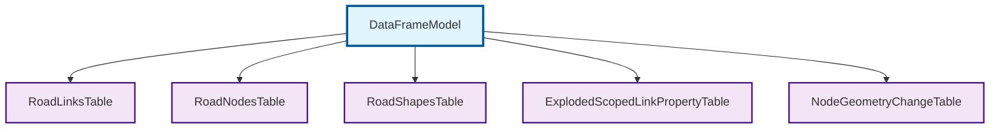

# Data Models

Network Wrangler uses [pandera's DataFrameModel](https://pandera.readthedocs.io/en/stable/reference/generated/pandera.api.pandas.model.DataFrameModel.html) as the base class for all data validation models. The following diagrams show the inheritance hierarchy of all DataFrameModel subclasses in the codebase:

### Roadway Data Models

### Transit/GTFS Data Models

```mermaid
graph TD
    A["DataFrameModel"]
    A --> B["AgenciesTable"]
    A --> C["StopsTable"]
    A --> D["RoutesTable"]
    A --> E["ShapesTable"]
    A --> F["TripsTable"]
    A --> G["FrequenciesTable"]
    A --> H["StopTimesTable"]
    
    C --> I["WranglerStopsTable"]
    E --> J["WranglerShapesTable"]
    F --> K["WranglerTripsTable"]
    G --> L["WranglerFrequenciesTable"]
    H --> M["WranglerStopTimesTable"]
    
    click A "https://pandera.readthedocs.io/en/stable/reference/generated/pandera.api.pandas.model.DataFrameModel.html"
    click B "../api_transit/#network_wrangler.models.gtfs.tables.AgenciesTable"
    click C "../api_transit/#network_wrangler.models.gtfs.tables.StopsTable"
    click D "../api_transit/#network_wrangler.models.gtfs.tables.RoutesTable"
    click E "../api_transit/#network_wrangler.models.gtfs.tables.ShapesTable"
    click F "../api_transit/#network_wrangler.models.gtfs.tables.TripsTable"
    click G "../api_transit/#network_wrangler.models.gtfs.tables.FrequenciesTable"
    click H "../api_transit/#network_wrangler.models.gtfs.tables.StopTimesTable"
    click I "../api_transit/#network_wrangler.models.gtfs.tables.WranglerStopsTable"
    click J "../api_transit/#network_wrangler.models.gtfs.tables.WranglerShapesTable"
    click K "../api_transit/#network_wrangler.models.gtfs.tables.WranglerTripsTable"
    click L "../api_transit/#network_wrangler.models.gtfs.tables.WranglerFrequenciesTable"
    click M "../api_transit/#network_wrangler.models.gtfs.tables.WranglerStopTimesTable"
    
    classDef pandera fill:#e1f5fe,stroke:#01579b,stroke-width:3px
    classDef gtfs fill:#e8f5e8,stroke:#1b5e20,stroke-width:2px
    classDef wrangler fill:#fff3e0,stroke:#e65100,stroke-width:2px
    
    class A pandera
    class B,C,D,E,F,G,H gtfs
    class I,J,K,L,M wrangler
```

**Legend:**

- 🔗 **DataFrameModel** - External pandera base class (links to pandera docs)
- **Purple** - Roadway network data models  
- **Green** - Standard GTFS transit data models
- **Orange** - Wrangler-enhanced GTFS models with additional fields

💡 **Tip:** Click on any box in the diagrams to jump directly to that class's documentation!
